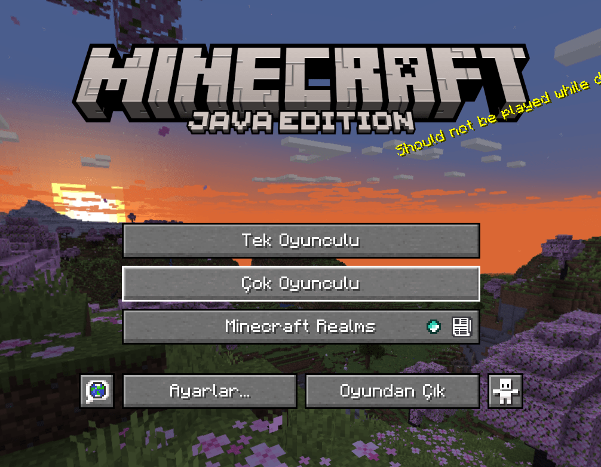
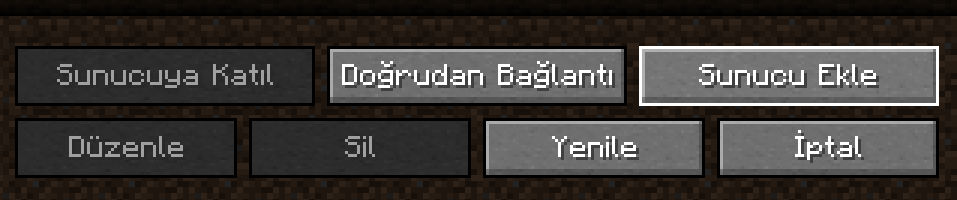
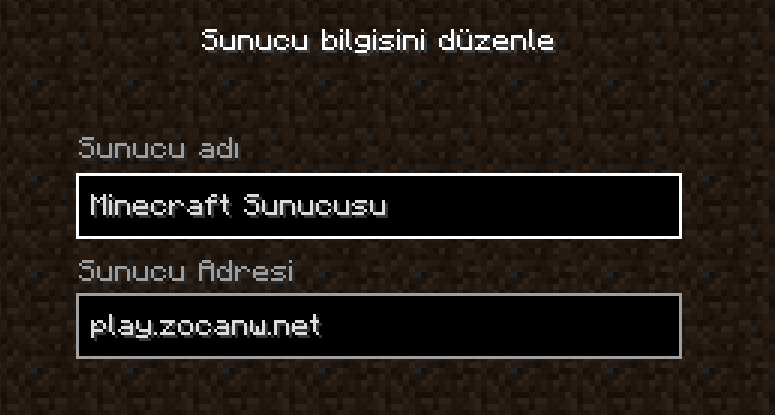
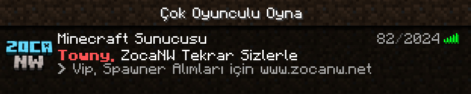

# 🖥️ Bilgisayar (Java)

ℹ️ Bunu yapabilmek için aşağıdaki adımları takip edebilirsiniz:

<strong>1.</strong> <strong>Çok Oyunculu / Multiplayer</strong> butonuna tıklayın.

<strong>2.</strong> <strong>Sunucu Ekle / Add Server</strong> butonuna tıklayın.

<strong>3.</strong> Sunucu bilgilerini girin.

<strong>4.</strong> Hazır! 🎉

